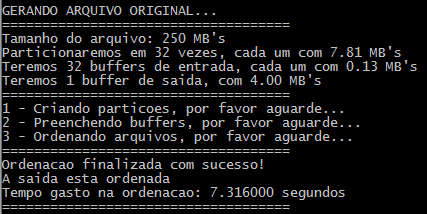

<h1 align="center">:rotating_light: Ordenação de Arquivos Grandes de Registros </h1>
<p align="center">
 Com o objetivo de ordenar arquivos com grande quantidade de <b><i>bytes</i></b> utilizando uma quantidade limitada de memoria principal, utilizamos a técnica de particionamento. Onde cada partição é ordenada pelo algoritmo de <b><i>quicksort</i></b> e terá um buffer de entrada auxiliar, iremos então utilizar intercalação por <b><i>k-vias</i></b> para preencher o buffer de saída.
 </p>
<p align="center">


</p>
<br>

## :accept: Feedback do Professor

Feedback atribuído em nosso trabalho pelo Professor Doutor Juliano Henrique Foleis que ministra o a matéria de Algoritmos e Estruturas de Dados 2 na Universidade Tecnologia Federal do Paraná (UTFPR/CM).


<br>
<br>

### :red_circle: Como utilizar

```bash
# Clone este repositório
$ git clone https://github.com/jhonatancunha/ed2_k-way_merge

# Acesse a pasta do projeto no terminal/cmd
$ cd ed2_k-way_merge

# Execute o makefile (windows)
$ mingw32-make

# Execute o makefile (linux)
$ make

# Por fim inicie o executavel
#Windows
$ main quantidadeDeRegistros maximoDeMemoriaDisponivel porçãoMemoriaBufferSaida
#Linux
$ ./main quantidadeDeRegistros maximoDeMemoriaDisponivel porçãoMemoriaBufferSaida
```

### :mag: Explicação dos Argumentos

| Argumento                | Descrição                                                                                          |
|---------------------------|----------------------------------------------------------------------------------------------------|
| quantidadeDeRegistros     | É a quantidade de registros que serão criados pelo gerador de arquivo desordenado                   |
| maximoDeMemoriaDisponivel | Quantidade máxima de memória RAM em bytes disponível para o algoritmo utilizar durante a ordenação 
| porçãoMemoriaBufferSaida  | Divisor que será utilizado para obter a quantidade máxima de bytes do buffer de saída              |

### :camera_flash: Exemplo
```bash
#Executei passando os seguintes argumentos
#Windows
$ main 256000 8388608 2
#Linux
$ ./main 256000 8388608 2
```

* Recebemos 256000 em argv[1], então teremos um arquivo com 250 MB's
* Recebemos 8388608 em argv[2], então teremos um limite máximo de memoria disponivel de 8 MB'.
* Dividimos o mesmo em 32 vezes, então cada uma terá 7.81 MB's
* Antes de salvar cada partição, ordenamos a mesma utilizando o algoritmo de QuickSort
* Recebemos 2 em argv[3], então eremos um buffer de saída com 4 MB's, ou seja, 8/2
* Teremos 32 buffers de entrada cada um com 0,125 MB's
* Criamos e preenchemos os buffers de entrada, reenchemos o mesmo caso necessario
* Utilizamos o algoritmo de intercalação em k-vias para preencher o buffer de saida, quando o mesmo estiver cheio, realizamos um dump no arquivo saida.dat
* Por fim quando todos os buffers estiverem vazios teremos um arquivo saida.dat, onde todos nossos dados estarão ordenados.

Obtemos as seguintes informações como saida do algoritmo.<br>


### :chart_with_upwards_trend: [Visualize o relatório sobre o funcionamento do algoritmo](https://github.com/jhonatancunha/ed2_k-way_merge/blob/master/APS1%20ED2%20-%20RELATORIO.pdf) 

### :mortar_board: Autores

<table><tr>
<td align="center"><a href="https://github.com/jhonatancunha">
 
<br />
 <b>Jhonatan Cunha</b></a>
 <a href="https://github.com/jhonatancunha" title="Repositorio Jhonatan"></a>

[](mailto:jhonatancunha@alunos.utfpr.edu.br)</td>

<td align="center"><a href="https://github.com/JessePires">
 
<br />
 <b>Jessé Pires</b>
 </a> <a href="https://github.com/JessePires" title="Repositorio Jessé"></a>

[](mailto:jessepires@alunos.utfpr.edu.br)</td>
</tr></table>

## :memo: Licença
[MIT](https://choosealicense.com/licenses/mit/)
